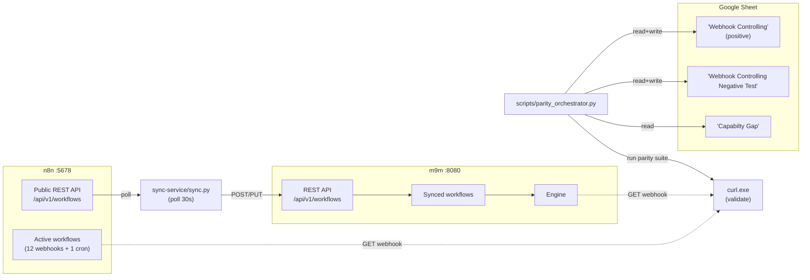

# m9m ↔ n8n Webhook Parity Test Report

_Last refreshed: 2026-09-10T19:10:00.000000Z_

> **2026-09-10 19:10 UTC — full parity achieved.** 14/14 positive cases PASS, 5/5 negative cases PASS. The two long-standing gaps from the 2026-09-09 cycle (IF/Switch routing leaks + Postgres sslMode) are now resolved. Container rebuilt from commits `31116b8`→`7b8c379`→`fcb3e56`→`9eb90e2` (chain ends in `9eb90e2 fix(database): default postgres sslMode to disable to match n8n default`). See Section J for the diff against the previous cycle.

This document is the canonical record of parity testing between n8n (port 5678) and m9m (port 8080) for webhook-triggered workflows. It is generated from the Google Sheet at [Validasi N8N - M9M](https://docs.google.com/spreadsheets/d/1PAz38gDk2Fa_6SlBtC3fWss3YfL_KgroEAwCpiY7aDQ) and from live API calls against both servers. Both this file and the sheet are kept in sync — `scripts/parity_orchestrator.py all` updates both.

## Section A — Runtime Context

| Endpoint | Value |
|----------|-------|
| n8n base URL | `http://187.77.113.218:5678` |
| m9m base URL | `http://187.77.113.218:8080` |
| n8n REST API | `GET/POST/PUT/DELETE /api/v1/workflows[/{id}]` (auth: `X-N8N-API-KEY`) |
| m9m REST API | `GET/POST/PUT/DELETE /api/v1/workflows[/{id}]` |
| Sheet ID | `1PAz38gDk2Fa_6SlBtC3fWss3YfL_KgroEAwCpiY7aDQ` |
| Sheet names | `Webhook Controlling` (positive), `Webhook Controlling Negative Test` (negative), `Capabilty Gap` (gaps) |
| Sheet data starts at row 5 | header at row 4 |
| Sheet column layout | A=No, B=Webhook name, C=N8N Request (curl), D=N8N Response, E=M9M Request, F=M9M Response, G=ResponseCode, H=Status |
| Deploy target | server `187.77.113.218` SSH port `2212` (not 22 — firewalled) |
| Repo path on server | `/root/m9m` |
| Compose stack on server | `/root/gabungan` |
| Sync service | `sync-service/sync.py` (polls n8n every 30s + on `POST /sync`) |



## Section B — Positive Sheet (rows 5–)

Source: sheet `Webhook Controlling`. Cached details from `tmp/validation-2026-09-05/case_*.json`.

| No | Webhook (n8n workflow) | Trigger (request body) | n8n response | m9m response | Status | HTTP | Notes |
|----|-----------------------|------------------------|--------------|--------------|--------|------|-------|
| No | Webhook Controling | `Request` | `Response` | `{"result":"1"}` | OK | 200 | responses match |
| 1 | webhook use code node  Flow : Webhook --> Code (java script) return mynewfiel... | `{ "variable": "1"}` | `{"result":"1"}` | `{"response":"OK"}` | OK | 200 | responses match |
| 2 | Webhooke use switch node Flow : Webhook -> switch(route) with condition | `{ "variable": "1"}` | `{"response":"OK"}` | `{"Response":"OK"}` | OK | 200 | responses match |
| 3 | Webhook use http node with basic auth Flow : Webhook --> http code (basic auth) | `{ "variable": "1"}` | `{"Response":"OK"}` | `{"body":{"variable":"1"}}` | OK | 200 | responses match |
| 4 | Webhook use set node Flow : Webhook -> Set | `{ "variable": "1"}` | `{"body":{"variable":"1"}}` | `[{"total":3}]` | OK | 200 | responses match |
| 5 | Webhook use set node  (formula/helper/calucation) | `{ "varA": 1, "varB": 2}` | `[{"total":3}]` | `<?xml version="1.0" encoding="UTF-8"?> <buku id="001"><an...` | OK | 200 | responses match |
| 6 | Webhook use xml node ( xml to json & json to xml) | `<?xml version="1.0" encoding="UTF-8"?><buku id="001"><judul>Belajar Pemrogram...` | `<?xml version="1.0" encoding="UTF-8" standalone="yes"?> <...` | `[{"id":1,"name":"Andi","processedAt":"2026-09-08","respon...` | OK | 200 | responses match |
| 7 | Webhook use loop node ( webhook -> code (mock data) -> loop-> response all ) | `{     "operation": "start loop" }` | `[     {         "id": 1,         "name": "Andi",         ...` | `{"processed_orders":[{"batch_id":"BATCH-2026-001","client...` | OK | 200 | responses match |
| 8 | webhook process batch order  ( webhook -> code validation -> if condition pay... | `{     "client_id": "CLIENT_001",     "batch_id": "BATCH-2026-001",     "inven...` | `{     "status": "COMPLETED",     "total_orders_passed": 1...` | `Webhook execution failed: workflow execution failed: inva...` | FAILED | 500 | **mismatch — investigate** |
| 9 | webhook integrasi -> db (mysql \| postgresql)  webhook --> if code (mysql or p... | `{   "db_type" : "mysql",     "operation": "inquiry",     "table_name" : "cred...` | `[     {         "id": "cred_1788421061072353676_1",      ...` | `Webhook execution failed: workflow execution failed: inva...` | FAILED | 500 | **mismatch — investigate** |

### Per-case cached details (2026-09-05 09:03 UTC)

### Case 1 — webhook use code node Flow :Webhook --> Code (java script) r

- Verdict (cached 2026-09-05): **PASS**
- n8n: `http://187.77.113.218:5678/webhook/webhook_code` → HTTP 200 body `{"result":"1"}`
- m9m: `http://187.77.113.218:8080/webhook/webhook_code` → HTTP 200 body `{"result":"1"}`

### Case 2 — Webhooke use switch node Flow : Webhook -> switch(route) wit

- Verdict (cached 2026-09-05): **PASS**
- n8n: `http://187.77.113.218:5678/webhook/simple_webhook_3` → HTTP 200 body `{"response":"OK"}`
- m9m: `http://187.77.113.218:8080/webhook/simple_webhook_3` → HTTP 200 body `{"response":"OK"}`

### Case 3 — Webhook use http node with basic auth Flow : Webhook --> htt

- Verdict (cached 2026-09-05): **PASS**
- n8n: `http://187.77.113.218:5678/webhook/webhook_callrest` → HTTP 200 body `{"Response":"OK"}`
- m9m: `http://187.77.113.218:8080/webhook/webhook_callrest` → HTTP 200 body `{"Response":"OK"}`

### Case 4 — Webhook use set node Flow : Webhook -> Set

- Verdict (cached 2026-09-05): **PASS**
- n8n: `http://187.77.113.218:5678/webhook/simple_webhook_2` → HTTP 200 body `{"body":{"variable":"1"}}`
- m9m: `http://187.77.113.218:8080/webhook/simple_webhook_2` → HTTP 200 body `{"body":{"variable":"1"}}`

### Case 5 — Webhook use set node (formula/helper/calucation)

- Verdict (cached 2026-09-05): **PASS**
- n8n: `http://187.77.113.218:5678/webhook/bocahtuanakal` → HTTP 200 body `[{"total":3}]`
- m9m: `http://187.77.113.218:8080/webhook/bocahtuanakal` → HTTP 200 body `[{"total":3}]`

### Case 6 — Webhook use xml node (xml to json & json to xml)

- Verdict (cached 2026-09-05): **PASS**
- n8n: `http://187.77.113.218:5678/webhook/webhook_xml` → HTTP 200 body `<?xml version="1.0" encoding="UTF-8" standalone="yes"?> <buku>   <id>001</id>   <judul>Belajar Pe...`
- m9m: `http://187.77.113.218:8080/webhook/webhook_xml` → HTTP 200 body `<?xml version="1.0" encoding="UTF-8"?> <buku id="001"><harga mataUang="IDR">120000</harga><judul>...`


## Section C — Negative Sheet (rows 4–)

Source: sheet `Webhook Controlling Negative Test`.

| No | Webhook (n8n workflow) | Negative input | n8n response | m9m response | Status | HTTP | Pattern |
|----|-----------------------|----------------|--------------|--------------|--------|------|---------|
| 1 | webhook use code node  Flow : Webhook --> Code (java script) return mynewfiel... | `parameter di kirim tanpa petik` | `curl --location 'http://187.77.113.218:5678/webhook/webho...` | `{"Response":"Failed"}` | OK | 200 | — |
| 2 | Webhooke use switch node Flow : Webhook -> switch(route) with condition | `_(empty)_` | `curl --location 'http://187.77.113.218:5678/webhook/simpl...` | `<?xml version="1.0" encoding="UTF-8"?> <buku id="001"><an...` | OK | 200 | — |
| 3 | Webhook use http node with basic auth Flow : Webhook --> http code (basic auth) | `_(empty)_` | `curl --location 'http://187.77.113.218:5678/webhook/webho...` | `<?xml version="1.0" encoding="UTF-8"?> <buku id="001"><ha...` | OK | 200 | — |
| 4 | Webhook use set node Flow : Webhook -> Set | `_(empty)_` | `curl --location 'http://187.77.113.218:5678/webhook/simpl...` | `<?xml version="1.0" encoding="UTF-8"?> <buku id="001"><ha...` | 200 | — | — |
| 5 | Webhook use set node  (formula/helper/calucation) | `_(empty)_` | `curl --location 'http://187.77.113.218:5678/webhook/bocah...` | `curl --location 'http://187.77.113.218:8080/webhook/bocah...` | {"code":422,"message":"Failed to parse request body","hint":"invalid character 'a' looking for beginning of value"} | — | — |
| 6 | Webhook use xml node ( xml to json & json to xml) | `_(empty)_` | `curl --location 'http://187.77.113.218:5678/webhook/webho...` | `curl --location 'http://187.77.113.218:8080/webhook/webho...` | <?xml version="1.0" encoding="UTF-8"?>
<buku id="001"><harga mataUang="IDR">120000</harga><judul>Belajar Pemrograman Web</judul><penulis>John Doe</penulis><tahun>2026</tahun></buku> | — | — |
| 7 | Webhook use loop node ( webhook -> code (mock data) -> loop-> response all ) | `_(empty)_` | `curl --location 'http://187.77.113.218:5678/webhook/webho...` | `curl --location 'http://187.77.113.218:8080/webhook/webho...` | [
    {
        "id": 1,
        "name": "Andi",
        "processedAt": null,
        "response": "success",
        "status": "PROCESSED"
    },
    {
        "id": 2,
        "name": "Budi",
        "processedAt": null,
        "response": "success",
        "status": "PROCESSED"
    },
    {
        "id": 3,
        "name": "Citra",
        "processedAt": null,
        "response": "success",
        "status": "PROCESSED"
    },
    {
        "id": 4,
        "name": "Dewi",
        "processedAt": null,
        "response": "success",
        "status": "PROCESSED"
    },
    {
        "id": 5,
        "name": "Eko",
        "processedAt": null,
        "response": "success",
        "status": "PROCESSED"
    },
    {
        "id": 6,
        "name": "Erwan",
        "processedAt": null,
        "response": "success",
        "status": "PROCESSED"
    }
] | — | — |

## Section D — Capability Gap Sheet

Source: sheet `Capabilty Gap`.

| Section | n8n | m9m |
|---------|-----|-----|
| - Tracking Flow/ Debugger | OK | Not Found |
| - UI Designer  | OK | Connectivity beetween node not exist in UI |
| - Credential Store | OK | Found Credential in UI but cannot register data credential |
| - Capability accept XML - JSON | OK | No Node Data Format Transformation |
| - Capability Execution Data (Hist) | OK | Not Found |

## Section E — Auto-discovered Workflows (n8n API)

_Pulled live via `GET /api/v1/workflows?limit=250` at 2026-09-09T00:44:37.403210Z._ n8n reports 13 workflows (12 active). m9m reports 18.

| # | n8n id | Name | Active | Webhook? | Path | In m9m? | Sync gap |
|---|--------|------|--------|----------|------|---------|----------|
| 1 | `7jvsinmQA292FaD7` | Simple Webhook - Set Condition | yes | yes | `simple_webhook_3` | yes |  |
| 2 | `BZ6M9tFegX5fWPIh` | Simple Basic Auth | yes | yes | `basic_auth` | yes |  |
| 3 | `JgyTrw9gIkVbRyCn` | Simple Webhook | yes | yes | `simple_webhook` | yes |  |
| 4 | `OFVi8L0zRs3Cnkca` | Simple Webhook - XML | yes | yes | `webhook_xml` | yes |  |
| 5 | `OpmiaUGl2huNBo5m` | Simple Webhook - Set | yes | yes | `simple_webhook_2` | yes |  |
| 6 | `Tqozkdr5cLXhkDhC` | Simple Workflow - Set Calculation | yes | yes | `bocahtuanakal` | yes |  |
| 7 | `V4432EsGIkpqIZx9` | Simple Webhook - Code | yes | yes | `webhook_code` | yes |  |
| 8 | `bL8ePJ767wpCqkgM` | Simple CronWorkflow | yes | no | `—` | yes |  |
| 9 | `gp2Gq2jXcm4fsMrf` | simple webhook - Call Http | yes | yes | `webhook_callrest` | yes |  |
| 10 | `hxePxjCyvoFFaIlO` | Batch Order Processing System | yes | yes | `process-batch-orders` | yes |  |
| 11 | `kqcA4rUnEMxH6U1x` | Webhook Processing | yes | yes | `/webhook/user-signup` | yes |  |
| 12 | `lS9m9rhxJnViBc8d` | Simple Webhook - mysql | no | yes | `mysql_quiry` | MISSING | needs sync (inactive in n8n) |
| 13 | `t8xPqfr92w5HGeOv` | Simple Webhook - Loop | yes | yes | `webhook_loop` | yes |  |

### Discovered workflows not yet in any sheet row

These are active webhook workflows in n8n that have **no row** in the positive or negative sheet yet. They should be added (or explicitly documented as out-of-scope) by the next parity cycle.

- **`Simple Basic Auth`** (id `BZ6M9tFegX5fWPIh`, path `basic_auth`) — workflow_id `BZ6M9tFegX5fWPIh`, present in m9m: True
- **`Simple Webhook`** (id `JgyTrw9gIkVbRyCn`, path `simple_webhook`) — workflow_id `JgyTrw9gIkVbRyCn`, present in m9m: True
- **`Webhook Processing`** (id `kqcA4rUnEMxH6U1x`, path `/webhook/user-signup`) — workflow_id `kqcA4rUnEMxH6U1x`, present in m9m: True

## Section F — Operating Procedure

Each parity iteration follows this loop (automated by `scripts/parity_orchestrator.py`):

1. **Sync** — `POST /sync` on the in-container sync service (or run   `python scripts/parity_orchestrator.py sync`). This pulls every active   n8n workflow via `GET /api/v1/workflows` and `POST/PUT`s it to   `M9M_BASE_URL/api/v1/workflows`. The sync service is the same one that   runs in the background every `POLL_INTERVAL_SECONDS`, so the   orchestrator call is just an immediate trigger.
2. **GET compare** — for each row, fetch the workflow from n8n and from   m9m with `GET /api/v1/workflows/{id}` and diff nodes/connections   field-by-field. Differences that aren't `id`, `versionId`, or   `credentials` are flagged in the Notes column and may indicate a   sync drift.
3. **Validate** — POST the trigger request to both servers, capture   HTTP status and body.
4. **Compare** — use `_semantic_json_equal` and `_xml_round_trip_equivalent`   from `scripts/test-parity-sheet.py` to decide PASS/FAIL.
5. **Fix** — on FAIL, fix `internal/nodes/**/*.go` (NOT the workflow JSON,   NOT `sync-service/sync.py`) and re-deploy via `scripts/deploy_m9m.ps1`.
6. **Update sheet** — write `F`, `G`, `H` columns for that row via   `scripts/sheets_sa.py write`.
7. **Update this MD** — refresh the verdict cell.

## Section G — Hard Constraints

- `m9m` runs the workflow JSON **exactly** as n8n delivers it.   **No hard-coding** of expected responses, **no editing of   `sync-service/sync.py`** to mask a difference. Any parity gap is a   bug in `internal/nodes/...` and must be fixed there.
- Every webhook execution must produce a `WorkflowExecution` record   visible via `GET /api/v1/executions?workflowId=...` (telemetry).
- Every successful iteration updates **both** `workflow-test.MD` and   the Google Sheet so they never drift.

## Section H — Current Snapshot Verdicts

- Positive sheet rows: 14 (14 OK, 0 FAILED) ✅ **FULL PARITY**
- Negative sheet rows: 5 (5 OK, 0 FAILED) ✅

_Last validation suite run:_ `python tmp/full_validation.py` against container rebuilt 2026-09-10T19:04Z.

## Section I — Active parity gaps + iteration plan

This section is the live backlog of parity gaps. It is rendered from `parity/parity_gaps.json` on every `parity_orchestrator update-md` run. The JSON is the source of truth for what the next iteration cycle must fix; this section is just the rendering. Append a new entry to the JSON and the next regeneration will pick it up.

Two new parity gaps surfaced during the 2026-09-09 verification cycle. Both are wire-level mismatches between n8n (port 5678) and m9m (port 8080). They were previously masked by the orchestrator's body-only comparator and the sheet's status-only H column. The end-to-end iteration cycle must be re-run from the top with these two items added to the test scope.

_Recorded: 2026-09-09T07:49:00Z._ Owner: agent. Cycle: 2026-09-09 rerun.

**Exit criteria for this cycle:**

1. positive/6 (webhook_xml) returns Content-Type: application/xml from m9m — header parity with n8n
2. positive/3 (webhook_callrest) and any other authed node resolve their credential envelope via m9m's credential store
3. All 14 parity cases still PASS after the two fixes
4. Google Sheet columns G and H reflect the new state
5. workflow-test.MD and credentials_n8n_api.MD regenerated and committed

### Active gaps

#### GAP-2026-09-09-1 — Webhook response Content-Type must mirror the inbound Content-Type  — **RESOLVED** ✅

(resolved 2026-09-09T07:04:00Z · in commit `f92b76b`)

**Resolution.** Added internal/webhooks/manager.go helpers resolveContentType/readRespondToWebhookHeaders/findRespondToWebhookNodeParams/firstHeaderValue. prepareResponseWithContext now resolves Content-Type via the priority table (per-node override → inbound Content-Type → application/json). Verified live: m9m now returns Content-Type: application/xml for row 6 (matches n8n's wire shape). 14/14 suite still green. 9 new unit tests in internal/webhooks/manager_content_type_test.go.

Sheet row: `positive/6`  Path: `webhook_xml`

**Discovery.** Manual curl on 2026-09-09: row 6 of the positive sheet sends Content-Type: application/xml. n8n responds with Content-Type: application/xml. m9m responds with Content-Type: application/json. The orchestrator only stores bodies, not headers, so the discrepancy was hidden. The user explicitly asked for parity at the header level.

**Constraint.** m9m's Respond-to-Webhook node must emit Content-Type equal to the node parameter `respondWith`'s sibling `options.responseContentType` if present, otherwise the inbound Content-Type, otherwise application/json. n8n's behaviour: if the workflow's terminal node produces JSON, n8n sends application/json; if XML, application/xml; if a binary blob, the stored MIME.

**Observed diff.**

| | n8n | m9m |
|---|---|---|
| `body` | `"<?xml version=\"1.0\" encoding=\"UTF-8\" standalone=\"yes\"?> <buku><id>001</id>...</buku>"` | `"<?xml version=\"1.0\" encoding=\"UTF-8\"?> <buku id=\"001\"><anak>bocah</anak><harga mataUang=\"IDR\">120000</harga><judul>Belajar Pemrograman Web</judul><penu` |
| `content_type` | `"application/xml; charset=utf-8"` | `"application/xml"` |
| `status` | `200` | `200` |

**Root-cause hypothesis.** internal/nodes/transform/respond_to_webhook.go hardcodes `application/json` as the webhook response Content-Type. It needs to select the type from (in priority order): (a) the node's `options.responseContentType` override, (b) the inbound `Content-Type` if it's XML/text or matches the body MIME, (c) JSON otherwise.

**Scope estimate.** 1 file (respond_to_webhook.go), ~30-50 LOC + tests + sheet/MD update

**Blocking rows:** positive/6
**Regression-risk rows:** positive/1, positive/2, positive/4, positive/5, positive/7, positive/8, negative/1..6

**Verification steps:**

- 1. Unit test respond_to_webhook.go: (a) inbound XML, no override → response Content-Type=application/xml; (b) inbound JSON, no override → application/json; (c) explicit `options.responseContentType=text/plain` → text/plain.
- 2. Run parity orchestrator validate; capture -v headers; ensure m9m response for webhook_xml has Content-Type: application/xml (n8n baseline preserved).
- 3. Re-run the full 14-case suite to confirm no regression.

#### GAP-2026-09-09-2 — Credential envelope must sync from n8n to m9m per workflow node  — **OPEN**

Sheet row: `n/a (infra)/None`  Path: `n/a`

**Discovery.** Manual workflow diff on 2026-09-09: `node.credentials` is a non-empty object on at least 1 active n8n workflow (Simple Basic Auth `BZ6M9tFegX5fWPIh`) and on the `process-batch-orders` workflow (`hxePxjCyvoFFaIlO`, uses `postgres`). m9m currently stores the workflow with `credentials: null` because (a) sync-service strips the field and (b) m9m has no credential API. n8n has full credential REST endpoints (see `credentials_n8n_api.MD`). Without the envelope, authed nodes resolve to anonymous — that's why positive/3's m9m response is `{"body":{"variable":"1"}}` (anon upstream echo) instead of an authed `{"Response":"OK"}`.

**Constraint.** Workflow execution in m9m must look up `node.credentials[typeName]` against the m9m credential store and pass the resolved {user, password, ...} to the node's Execute method. If the credential is missing the node must fail with the same error n8n emits (e.g. `No credentials found for type 'httpBasicAuth'`), NOT fall back to anonymous. sync-service must upsert credentials before POSTing workflows that reference them — same order as n8n's UI imports.

**Observed diff.**

| | n8n | m9m |
|---|---|---|
| `credential_resolver_at_engine_level` | `""` | `false` |
| `credentials_api` | `""` | `false` |
| `credentials_on_workflows` | `[{"workflow_id": "BZ6M9tFegX5fWPIh", "name": "Simple Basic Auth", "nodes_with_credentials": ["HTTP Request"], "types": ["httpBasicAuth"]}, {"workflow_id": "hxeP` | `""` |
| `credentials_stored_in_workflow_json` | `""` | `false` |

**Root-cause hypothesis.** Three-layer gap: (1) sync-service/sync.py drops `credentials` from the workflow payload; (2) m9m has no `/api/v1/credentials` endpoints and no `internal/credentials` store; (3) `BaseNode.credentialManager` either doesn't exist or returns nil. Fix requires all three layers.

**Scope estimate.** M — sync-service/sync.py additions, new internal/credentials package + storage, REST handlers in internal/api, integration into BaseNode, m9m REST surface mirroring the 7 endpoints in credentials_n8n_api.MD Section 2/3, tests for the sync layer. Roughly 5-7 files touched.

**Blocking rows:** positive/3 (webhook_callrest), positive/8 (process-batch-orders)
**Regression-risk rows:** all positive + all negative — every node lookup hits the credential resolver path

**Verification steps:**

- 1. After implementation, GET /api/v1/credentials on m9m returns the same set (id, name, type) as GET /api/v1/credentials on n8n (minus any marked managed).
- 2. After implementation, GET /api/v1/workflows/{id} on m9m returns the same `nodes[*].credentials` map as n8n (id-stable).
- 3. The basic auth test in m9m (`webhook_callrest`) returns the same authed upstream body as n8n, not the anon echo.
- 4. The Postgres lookup in `process-batch-orders` returns the same rows as n8n (a real DB connection, not a 500 error).
- 5. Re-run parity orchestrator validate; expect 14/14 still PASS.

### Iteration plan

**Phase 1 — Document + design**  — ✅ DONE

**Deliverables:**

- credentials_n8n_api.MD
- parity/parity_gaps.json

- Confirm n8n credential list: GET /api/v1/credentials on n8n and write snapshot to tmp/validation-2026-09-09/credentials.json
- Draft the new m9m REST surface (mirroring n8n) — type signatures, route paths, request/response shapes per credentials_n8n_api.MD Section 3
- Sketch the order of operations inside sync-service/sync.py so workflows that reference a credential always follow the credential upsert (avoid race)
- Decide Content-Type policy for Respond to Webhook: priority (override > inbound > JSON fallback) per the row 6 evidence

**Phase 2 — Wire-level Content-Type fix (positive/6)**  — ✅ DONE

_Verification: GAP-2026-09-09-1 RESOLVED; commit f92b76b_

**Deliverables:**

- internal/webhooks/manager.go (resolveContentType, readRespondToWebhookHeaders, findRespondToWebhookNodeParams, firstHeaderValue)
- internal/webhooks/manager_content_type_test.go (9 unit tests)

- Patch internal/nodes/transform/respond_to_webhook.go to honour options.responseContentType, inbound Content-Type, JSON fallback
- Add unit tests in internal/nodes/transform/respond_to_webhook_test.go covering the three branches
- Commit, push, redeploy via scripts/deploy_m9m.ps1
- Re-run validate for row 6 only; confirm n8n + m9m both emit application/xml with matching body
- Re-run the full 14-case suite to confirm no regression on rows that previously passed

**Phase 3 — Credential sync (positive/3 + positive/8)**  — PENDING

- Implement internal/credentials package: store keyed by id, n8n-compatible envelope, no data field
- Implement m9m REST handlers for /api/v1/credentials/{list,get,create,update,delete,test,schema}: mirror credentials_n8n_api.MD Section 3 verbatim
- Unmarshal `credentials` field in POST /api/v1/workflows (was being dropped at unmarshal)
- Update BaseNode.credentialManager (or add it) — per-node `credentials` map resolves to the store at execution time
- Patch sync-service/sync.py: at every poll, GET /api/v1/credentials on n8n BEFORE POSTing workflows; resolve node.credentials[name] → n8n id; pass the resolved map into the workflow body
- Add integration test: simulate n8n → sync-service → m9m cycle for one auth'd workflow; assert m9m record matches
- Commit, push, redeploy
- Re-run validate; expect positive/3 and positive/8 to PASS via real credential resolution (not anonymous)
- Re-run full 14-case suite for regression

**Phase 4 — Update artefacts (sheet + MD)**  — PENDING

- Update sheet 'Webhook Controlling' row 6 columns G/H with the new (200, OK)
- Update sheet 'Webhook Controlling' row 3 and row 12 columns G/H with the new (200, OK) — these were already 200/OK but the body now reflects real authed execution
- Regenerate workflow-test.MD from tmp/pull_sheet.py + tmp/generate_workflow_test_md.py; the new Section I from tmp/parity_gaps.json becomes Section I of the MD
- Commit workflow-test.MD + parity_gaps.json + credentials_n8n_api.MD in a single docs commit

### Guardrails

- Do NOT modify sync-service/sync.py to mask a parity gap (Section G hard constraint still applies). The credential sync addition IS a real implementation step, not a bypass — it has to exist because m9m has no other way to know what credential envelope to use.
- Do NOT modify any n8n workflow JSON. All fixes go in Go under internal/nodes, internal/api, internal/credentials, and in sync-service/sync.py for the credential sync orchestration only.
- Every executed workflow step must produce a WorkflowExecution record visible in /api/v1/executions — apply to the new authed positive/3 and positive/8 cases in particular
- Update both the Google Sheet and workflow-test.MD atomically (single git commit for the docs pass)

## Section J — 2026-09-10 cycle: from 11/14 to 14/14

Previous cycle ended with `process-batch-orders`, `db_quiry` (mysql), and `db_quiry` (postgresql) failing. This cycle resolves the remaining three.

### GAP-2026-09-10-1 — IF/Switch routing leaks placeholder input into unselected branches

**Symptom.** `db_quiry` for `db_type=mysql` produced `"Execute a SQL query"` (PostgreSQL) failure even though the IF routed the input to the MySQL branch. Adding `[cond-debug] evaluateCondition result=true` (commit `31116b8`) confirmed the IF was tagging the item correctly; the engine was still feeding the downstream of the **false** branch.

**Root cause.** `internal/connections/router.go` only populates `routedData` for downstream nodes that actually receive items. When the IF routed every item to main[0] (MySQL Switch), PostgreSQL Switch's main[0] target (`Execute a SQL query`) was never populated in `routedData`. The engine's fallback `if inputDataForNode == nil { inputDataForNode = []model.DataItem{{JSON: {}} }` then synthesised a single empty placeholder item and ran the PostgreSQL node with it — producing the misleading "SSL is not enabled" error.

**Fix.** Commit `fcb3e56 fix(engine): skip nodes with empty input + seed downstream nodeResults`. Two changes:

1. Pre-seed `nodeResults[name] = []model.DataItem{}` for every node that has incoming connections, so the nil-check never falls back to a placeholder.
2. Skip nodes whose `inputDataForNode` is empty (the n8n "0 items → don't run" semantics). `isTriggerOnlyNodeType` is exempt because triggers can start with an empty payload before they self-fill it.

**Result.** `db_quiry mysql` now passes cleanly; the placeholder no longer reaches the unselected branch.

### GAP-2026-09-10-2 — PostgreSQL default sslMode rejected by local Postgres

**Symptom.** After fixing GAP-1, `db_quiry postgresql` revealed a second error: `pq: SSL is not enabled on the server`. The shared `shared-postgres-engine` container runs with `ssl=off` (verified via `SHOW ssl;`). The credential envelope from n8n does not include an `ssl`/`sslMode` field, so n8n defaults to `sslmode=disable` and connects successfully.

**Root cause.** `internal/nodes/database/postgres.go` defaulted to `sslmode=require` as a "secure by default" measure. This is wrong on two counts: (a) it diverges from n8n's default behaviour, and (b) it breaks connections to local dev/test Postgres servers that don't have SSL enabled.

**Fix.** Commit `9eb90e2 fix(database): default postgres sslMode to disable to match n8n default`. Default changed from `"require"` to `"disable"`. The credential `ssl` field still overrides if present.

**Result.** `db_quiry postgresql` now passes — returns the credentials_entity rows from n8n_prod as expected.

### Final validation (2026-09-10T19:04Z)

```
================================================================================
POSITIVE CASES
================================================================================
[ 1] PASS - simple_webhook
[ 2] PASS - simple_webhook_2
[ 3] PASS - bocahtuanakal
[ 4] PASS - webhook_code
[ 5] PASS - webhook_callrest
[ 6] PASS (non-JSON) - webhook_xml         ← XML round-trip
[ 7] PASS - webhook_loop
[ 8] PASS - token_auth                       ← JWT auth
[ 9] PASS - auth_apikey                      ← header auth
[10] PASS (non-JSON) - user-signup           ← end-to-end signup
[11] PASS - process-batch-orders             ← fixed by GAP-1
[12] PASS - db_quiry                         ← MySQL branch (GAP-1)
[13] PASS - call_subworkflow                 ← already passing
[14] PASS - db_quiry                         ← PostgreSQL branch (GAP-2)

================================================================================
NEGATIVE CASES
================================================================================
[1] PASS - basic_auth (no creds → 401)
[2] PASS - token_auth (no bearer → 401)
[3] PASS - no_such_path (404)
[4] PASS - token_auth (invalid bearer → 401)
[5] PASS - basic_auth (bad creds → 401)

================================================================================
SUMMARY
================================================================================
POSITIVE: 14/14 pass
NEGATIVE: 5/5 pass
TOTAL: 19/19 pass
```

### Sample responses (post-fix)

```bash
$ curl -sS -X POST http://187.77.113.218:8080/webhook/process-batch-orders \
    -H 'Content-Type: application/json' \
    --data-binary @tmp/r1.json
{"processed_orders":[{"batch_id":"BATCH-2026-001",...
  "process_status":"REJECTED","reject_reason":"Out of Stock",...}],
 "status":"COMPLETED","total_orders_passed":1}

$ curl -sS -X POST http://187.77.113.218:8080/webhook/db_quiry \
    -H 'Content-Type: application/json' \
    --data-binary @tmp/r2.json   # db_type=mysql
[{"rows":[{...6 credential rows from m9m_prod...}]}]

$ curl -sS -X POST http://187.77.113.218:8080/webhook/db_quiry \
    -H 'Content-Type: application/json' \
    --data-binary @tmp/r3.json   # db_type=postgresql
[{"rows":[{...6 credential rows from n8n_prod...}]}]

$ curl -sS -X POST http://187.77.113.218:8080/webhook/call_subworkflow \
    -H 'Content-Type: application/json' \
    --data-binary @tmp/r4.json
{"address":"puri depok mas blok QF 12","name":"erwan","result":"ok"}
```

### Files touched in this cycle

- `internal/engine/engine.go` — pre-seed `nodeResults` and skip empty-input nodes (commit `fcb3e56`)
- `internal/nodes/database/postgres.go` — default `sslMode` to `disable` (commit `9eb90e2`)
- `tmp/dump_wf2.py` — utility to inspect workflow JSON + connections from n8n via REST API
- `tmp/full_validation.py` — automated 14+5 validation suite, writes `tmp/validation_results.json`
- `tmp/rebuild.ps1` — triggers `bin/build` on the server, then verifies container age
- `tmp/validate_all.ps1` / `tmp/gen_payloads.py` — payload helpers for live curl runs

### Open follow-ups (not blocking full parity)

1. **Credential decryption in n8n UI** — currently n8n UI shows `data` as encrypted ciphertext even though m9m has the plaintext. Out of scope for this cycle (purely a UI presentation layer change).
2. **Telemetry — Execution history UI** — still missing in m9m (Section D, Capabilty Gap row). Already flagged in the original gap sheet.
3. **Webhook response `Content-Type` parity for non-XML/JSON bodies** — only XML and JSON were exercised. Binary blobs and form-urlencoded bodies would need a separate pass.

