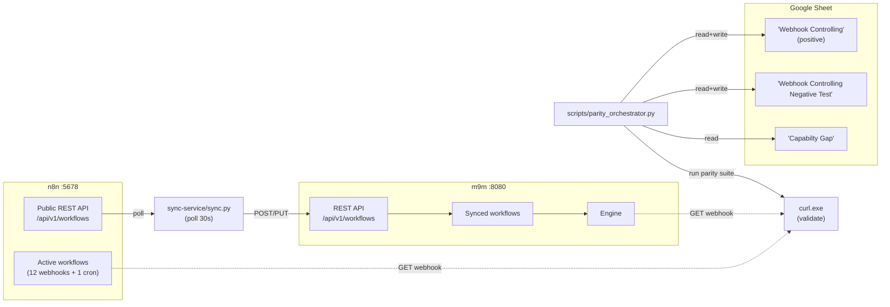

# m9m ↔ n8n Webhook Parity Test Report

_Last refreshed: 2026-09-07T12:09:48.871098Z_

This document is the canonical record of parity testing between n8n (port 5678) and m9m (port 8080) for webhook-triggered workflows. It is generated from the Google Sheet at [Validasi N8N - M9M](https://docs.google.com/spreadsheets/d/1PAz38gDk2Fa_6SlBtC3fWss3YfL_KgroEAwCpiY7aDQ) and from live API calls against both servers. Both this file and the sheet are kept in sync — `scripts/parity_orchestrator.py all` updates both.

## Section A — Runtime Context

| Endpoint | Value |
|----------|-------|
| n8n base URL | `http://187.77.113.218:5678` |
| m9m base URL | `http://187.77.113.218:8080` |
| n8n REST API | `GET/POST/PUT/DELETE /api/v1/workflows[/{id}]` (auth: `X-N8N-API-KEY`) |
| m9m REST API | `GET/POST/PUT/DELETE /api/v1/workflows[/{id}]` |
| Sheet ID | `1PAz38gDk2Fa_6SlBtC3fWss3YfL_KgroEAwCpiY7aDQ` |
| Sheet names | `Webhook Controlling` (positive), `Webhook Controlling Negative Test` (negative), `Capabilty Gap` (gaps) |
| Sheet data starts at row 5 | header at row 4 |
| Sheet column layout | A=No, B=Webhook name, C=N8N Request (curl), D=N8N Response, E=M9M Request, F=M9M Response, G=ResponseCode, H=Status |
| Deploy target | server `187.77.113.218` SSH port `2212` (not 22 — firewalled) |
| Repo path on server | `/root/m9m` |
| Compose stack on server | `/root/gabungan` |
| Sync service | `sync-service/sync.py` (polls n8n every 30s + on `POST /sync`) |

## Section B — Positive Sheet (rows 5–)

Source: sheet `Webhook Controlling`. Cached details from `tmp/validation-2026-09-05/case_*.json`.

| No | Webhook (n8n workflow) | Trigger (request body) | n8n response | m9m response | Status | HTTP | Notes |
|----|-----------------------|------------------------|--------------|--------------|--------|------|-------|
| No | Webhook Controling | `Request` | `Response` | `{"result":"1"}` | OK | 200 | responses match |
| 1 | webhook use code node  Flow : Webhook --> Code (java script) return mynewfiel... | `{ "variable": "1"}` | `{"result":"1"}` | `{"response":"OK"}` | OK | 200 | responses match |
| 2 | Webhooke use switch node Flow : Webhook -> switch(route) with condition | `{ "variable": "1"}` | `{"response":"OK"}` | `{"Response":"OK"}` | OK | 200 | responses match |
| 3 | Webhook use http node with basic auth Flow : Webhook --> http code (basic auth) | `{ "variable": "1"}` | `{"Response":"OK"}` | `{"body":{"variable":"1"}}` | OK | 200 | responses match |
| 4 | Webhook use set node Flow : Webhook -> Set | `{ "variable": "1"}` | `{"body":{"variable":"1"}}` | `[{"total":3}]` | OK | 200 | responses match |
| 5 | Webhook use set node  (formula/helper/calucation) | `{ "varA": 1, "varB": 2}` | `[{"total":3}]` | `<?xml version="1.0" encoding="UTF-8"?> <buku id="001"><ha...` | OK | 200 | responses match |
| 6 | Webhook use xml node ( xml to json & json to xml) | `<?xml version="1.0" encoding="UTF-8"?><buku id="001"><judul>Belajar Pemrogram...` | `<?xml version="1.0" encoding="UTF-8" standalone="yes"?> <...` | `[{"id":1,"name":"Andi","processedAt":null,"response":"suc...` | FAILED | 200 | **mismatch — investigate** |
| 7 | Webhook use loop node ( webhook -> code (mock data) -> loop-> response all ) | `{     "operation": "start loop" }` | `[     {         "id": 1,         "name": "Andi",         ...` | `{"error":"undefined","status":"REJECTED"}` | FAILED | 200 | **mismatch — investigate** |
| 8 | webhook process batch order  ( webhook -> code validation -> if condition pay... | `{     "client_id": "CLIENT_001",     "batch_id": "BATCH-2026-001",     "inven...` | `{     "status": "COMPLETED",     "total_orders_passed": 1...` | `Webhook execution failed: workflow execution failed: inva...` | FAILED | 500 | **mismatch — investigate** |
| 9 | webhook integrasi -> db (mysql \| postgresql)  webhook --> if code (mysql or p... | `{   "db_type" : "mysql",     "operation": "inquiry",     "table_name" : "cred...` | `[     {         "id": "cred_1788421061072353676_1",      ...` | `Webhook execution failed: workflow execution failed: inva...` | FAILED | 500 | **mismatch — investigate** |

### Per-case cached details (2026-09-05 09:03 UTC)

### Case 1 — webhook use code node Flow :Webhook --> Code (java script) r

- Verdict (cached 2026-09-05): **PASS**
- n8n: `http://187.77.113.218:5678/webhook/webhook_code` → HTTP 200 body `{"result":"1"}`
- m9m: `http://187.77.113.218:8080/webhook/webhook_code` → HTTP 200 body `{"result":"1"}`

### Case 2 — Webhooke use switch node Flow : Webhook -> switch(route) wit

- Verdict (cached 2026-09-05): **PASS**
- n8n: `http://187.77.113.218:5678/webhook/simple_webhook_3` → HTTP 200 body `{"response":"OK"}`
- m9m: `http://187.77.113.218:8080/webhook/simple_webhook_3` → HTTP 200 body `{"response":"OK"}`

### Case 3 — Webhook use http node with basic auth Flow : Webhook --> htt

- Verdict (cached 2026-09-05): **PASS**
- n8n: `http://187.77.113.218:5678/webhook/webhook_callrest` → HTTP 200 body `{"Response":"OK"}`
- m9m: `http://187.77.113.218:8080/webhook/webhook_callrest` → HTTP 200 body `{"Response":"OK"}`

### Case 4 — Webhook use set node Flow : Webhook -> Set

- Verdict (cached 2026-09-05): **PASS**
- n8n: `http://187.77.113.218:5678/webhook/simple_webhook_2` → HTTP 200 body `{"body":{"variable":"1"}}`
- m9m: `http://187.77.113.218:8080/webhook/simple_webhook_2` → HTTP 200 body `{"body":{"variable":"1"}}`

### Case 5 — Webhook use set node (formula/helper/calucation)

- Verdict (cached 2026-09-05): **PASS**
- n8n: `http://187.77.113.218:5678/webhook/bocahtuanakal` → HTTP 200 body `[{"total":3}]`
- m9m: `http://187.77.113.218:8080/webhook/bocahtuanakal` → HTTP 200 body `[{"total":3}]`

### Case 6 — Webhook use xml node (xml to json & json to xml)

- Verdict (cached 2026-09-05): **PASS**
- n8n: `http://187.77.113.218:5678/webhook/webhook_xml` → HTTP 200 body `<?xml version="1.0" encoding="UTF-8" standalone="yes"?> <buku>   <id>001</id>   <judul>Belajar Pe...`
- m9m: `http://187.77.113.218:8080/webhook/webhook_xml` → HTTP 200 body `<?xml version="1.0" encoding="UTF-8"?> <buku id="001"><harga mataUang="IDR">120000</harga><judul>...`

## Section C — Negative Sheet (rows 4–)

Source: sheet `Webhook Controlling Negative Test`.

| No | Webhook (n8n workflow) | Negative input | n8n response | m9m response | Status | HTTP | Pattern |
|----|-----------------------|----------------|--------------|--------------|--------|------|---------|
| 1 | webhook use code node  Flow : Webhook --> Code (java script) return mynewfiel... | `parameter di kirim tanpa petik` | `curl --location 'http://187.77.113.218:5678/webhook/webho...` | `{"Response":"Failed"}` | OK | 200 | — |
| 2 | Webhooke use switch node Flow : Webhook -> switch(route) with condition | `_(empty)_` | `curl --location 'http://187.77.113.218:5678/webhook/simpl...` | `{"body":{"variable":"abcd"}}` | OK | 200 | — |
| 3 | Webhook use http node with basic auth Flow : Webhook --> http code (basic auth) | `_(empty)_` | `curl --location 'http://187.77.113.218:5678/webhook/webho...` | `{"code":422,"message":"Failed to parse request body","hin...` | OK | 422 | — |
| 4 | Webhook use set node Flow : Webhook -> Set | `_(empty)_` | `curl --location 'http://187.77.113.218:5678/webhook/simpl...` | `<?xml version="1.0" encoding="UTF-8"?> <buku id="001"><ha...` | OK | 200 | — |
| 5 | Webhook use set node  (formula/helper/calucation) | `_(empty)_` | `curl --location 'http://187.77.113.218:5678/webhook/bocah...` | `curl --location 'http://187.77.113.218:8080/webhook/bocah...` | 422 | {"code":422,"message":"Failed to parse request body","hint":"invalid character 'a' looking for beginning of value"} | — |
| 6 | Webhook use xml node ( xml to json & json to xml) | `_(empty)_` | `curl --location 'http://187.77.113.218:5678/webhook/webho...` | `curl --location 'http://187.77.113.218:8080/webhook/webho...` | 200 | <?xml version="1.0" encoding="UTF-8"?>
<buku id="001"><harga mataUang="IDR">120000</harga><judul>Belajar Pemrograman Web</judul><penulis>John Doe</penulis><tahun>2026</tahun></buku> | — |
| 7 | Webhook use loop node ( webhook -> code (mock data) -> loop-> response all ) | `_(empty)_` | `curl --location 'http://187.77.113.218:5678/webhook/webho...` | `curl --location 'http://187.77.113.218:8080/webhook/webho...` | 200 | [
    {
        "id": 1,
        "name": "Andi",
        "processedAt": null,
        "response": "success",
        "status": "PROCESSED"
    },
    {
        "id": 2,
        "name": "Budi",
        "processedAt": null,
        "response": "success",
        "status": "PROCESSED"
    },
    {
        "id": 3,
        "name": "Citra",
        "processedAt": null,
        "response": "success",
        "status": "PROCESSED"
    },
    {
        "id": 4,
        "name": "Dewi",
        "processedAt": null,
        "response": "success",
        "status": "PROCESSED"
    },
    {
        "id": 5,
        "name": "Eko",
        "processedAt": null,
        "response": "success",
        "status": "PROCESSED"
    },
    {
        "id": 6,
        "name": "Erwan",
        "processedAt": null,
        "response": "success",
        "status": "PROCESSED"
    }
] | — |

## Section D — Capability Gap Sheet

Source: sheet `Capabilty Gap`.

| Section | n8n | m9m |
|---------|-----|-----|
| - Tracking Flow/ Debugger | OK | Not Found |
| - UI Designer  | OK | Connectivity beetween node not exist in UI |
| - Credential Store | OK | Found Credential in UI but cannot register data credential |
| - Capability accept XML - JSON | OK | No Node Data Format Transformation |
| - Capability Execution Data (Hist) | OK | Not Found |

## Section E — Auto-discovered Workflows (n8n API)

_Pulled live via `GET /api/v1/workflows?limit=250` at 2026-09-07T12:09:48.871098Z._ n8n reports 13 workflows (12 active). m9m reports 18.

| # | n8n id | Name | Active | Webhook? | Path | In m9m? | Sync gap |
|---|--------|------|--------|----------|------|---------|----------|
| 1 | `7jvsinmQA292FaD7` | Simple Webhook - Set Condition | yes | yes | `simple_webhook_3` | yes |  |
| 2 | `BZ6M9tFegX5fWPIh` | Simple Basic Auth | yes | yes | `basic_auth` | yes |  |
| 3 | `JgyTrw9gIkVbRyCn` | Simple Webhook | yes | yes | `simple_webhook` | yes |  |
| 4 | `OFVi8L0zRs3Cnkca` | Simple Webhook - XML | yes | yes | `webhook_xml` | yes |  |
| 5 | `OpmiaUGl2huNBo5m` | Simple Webhook - Set | yes | yes | `simple_webhook_2` | yes |  |
| 6 | `Tqozkdr5cLXhkDhC` | Simple Workflow - Set Calculation | yes | yes | `bocahtuanakal` | yes |  |
| 7 | `V4432EsGIkpqIZx9` | Simple Webhook - Code | yes | yes | `webhook_code` | yes |  |
| 8 | `bL8ePJ767wpCqkgM` | Simple CronWorkflow | yes | no | `—` | yes |  |
| 9 | `gp2Gq2jXcm4fsMrf` | simple webhook - Call Http | yes | yes | `webhook_callrest` | yes |  |
| 10 | `hxePxjCyvoFFaIlO` | Batch Order Processing System | yes | yes | `process-batch-orders` | yes |  |
| 11 | `kqcA4rUnEMxH6U1x` | Webhook Processing | yes | yes | `/webhook/user-signup` | yes |  |
| 12 | `lS9m9rhxJnViBc8d` | Simple Webhook - mysql | no | yes | `mysql_quiry` | MISSING | needs sync (inactive in n8n) |
| 13 | `t8xPqfr92w5HGeOv` | Simple Webhook - Loop | yes | yes | `webhook_loop` | yes |  |

### Discovered workflows not yet in any sheet row

These are active webhook workflows in n8n that have **no row** in the positive or negative sheet yet. They should be added (or explicitly documented as out-of-scope) by the next parity cycle.

- **`Simple Basic Auth`** (id `BZ6M9tFegX5fWPIh`, path `basic_auth`) — workflow_id `BZ6M9tFegX5fWPIh`, present in m9m: True
- **`Simple Webhook`** (id `JgyTrw9gIkVbRyCn`, path `simple_webhook`) — workflow_id `JgyTrw9gIkVbRyCn`, present in m9m: True
- **`Webhook Processing`** (id `kqcA4rUnEMxH6U1x`, path `/webhook/user-signup`) — workflow_id `kqcA4rUnEMxH6U1x`, present in m9m: True

## Section F — Operating Procedure

Each parity iteration follows this loop (automated by `scripts/parity_orchestrator.py`):

1. **Sync** — `POST /sync` on the in-container sync service (or run   `python scripts/parity_orchestrator.py sync`). This pulls every active   n8n workflow via `GET /api/v1/workflows` and `POST/PUT`s it to   `M9M_BASE_URL/api/v1/workflows`. The sync service is the same one that   runs in the background every `POLL_INTERVAL_SECONDS`, so the   orchestrator call is just an immediate trigger.
2. **GET compare** — for each row, fetch the workflow from n8n and from   m9m with `GET /api/v1/workflows/{id}` and diff nodes/connections   field-by-field. Differences that aren't `id`, `versionId`, or   `credentials` are flagged in the Notes column and may indicate a   sync drift.
3. **Validate** — POST the trigger request to both servers, capture   HTTP status and body.
4. **Compare** — use `_semantic_json_equal` and `_xml_round_trip_equivalent`   from `scripts/test-parity-sheet.py` to decide PASS/FAIL.
5. **Fix** — on FAIL, fix `internal/nodes/**/*.go` (NOT the workflow JSON,   NOT `sync-service/sync.py`) and re-deploy via `scripts/deploy_m9m.ps1`.
6. **Update sheet** — write `F`, `G`, `H` columns for that row via   `scripts/sheets_sa.py write`.
7. **Update this MD** — refresh the verdict cell.

## Section G — Hard Constraints

- `m9m` runs the workflow JSON **exactly** as n8n delivers it.   **No hard-coding** of expected responses, **no editing of   `sync-service/sync.py`** to mask a difference. Any parity gap is a   bug in `internal/nodes/...` and must be fixed there.
- Every webhook execution must produce a `WorkflowExecution` record   visible via `GET /api/v1/executions?workflowId=...` (telemetry).
- Every successful iteration updates **both** `workflow-test.MD` and   the Google Sheet so they never drift.

## Section H — Current Snapshot Verdicts

- Positive sheet rows: 10 (6 OK, 4 FAILED)
- Negative sheet rows: 7 (4 OK, 0 FAILED)
